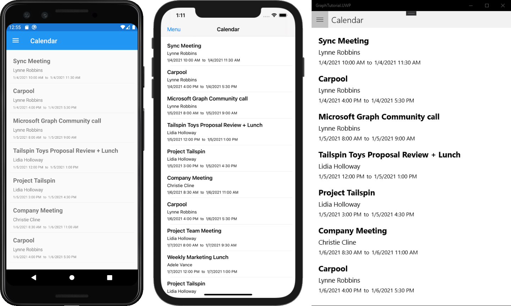

<!-- markdownlint-disable MD002 MD041 -->

在此练习中，你将将 Microsoft Graph合并到应用程序中。 对于此应用程序，你将使用[适用于 .NET 的 Microsoft Graph](https://github.com/microsoftgraph/msgraph-sdk-dotnet)客户端库调用 Microsoft Graph。

## <a name="get-calendar-events-from-outlook"></a>从 Outlook 获取日历事件

1. 打开 **GraphTu一** l 项目中的 **CalendarPage.xaml，** 并将其内容替换为以下内容。

    ```xaml
    <?xml version="1.0" encoding="utf-8" ?>
    <ContentPage xmlns="http://xamarin.com/schemas/2014/forms"
                 xmlns:x="http://schemas.microsoft.com/winfx/2009/xaml"
                 Title="Calendar"
                 x:Class="GraphTutorial.CalendarPage">
        <ContentPage.Content>
            <StackLayout>
                <Editor x:Name="JSONResponse"
                        IsSpellCheckEnabled="False"
                        HorizontalOptions="FillAndExpand"
                        VerticalOptions="FillAndExpand"/>
            </StackLayout>
        </ContentPage.Content>
    </ContentPage>
    ```

1. 打开 **CalendarPage.xaml.cs，** 在文件顶部 `using` 添加以下语句。

    ```csharp
    using Microsoft.Graph;

    using System.Collections.ObjectModel;
    using System.ComponentModel;
    ```

1. 将以下函数添加到 类，获取用户时区中本周 `CalendarPage` 的开始。

    :::code language="csharp" source="../demo/GraphTutorial/GraphTutorial/CalendarPage.xaml.cs" id="GetStartOfWeekSnippet":::

1. 将以下函数添加到 `CalendarPage` 类，获取用户的事件并显示 JSON 响应。

    ```csharp
    protected override async void OnAppearing()
    {
        base.OnAppearing();

        // Get start and end of week in user's time zone
        var startOfWeek = GetUtcStartOfWeekInTimeZone(DateTime.Today, App.UserTimeZone);
        var endOfWeek = startOfWeek.AddDays(7);

        var queryOptions = new List<QueryOption>
        {
            new QueryOption("startDateTime", startOfWeek.ToString("o")),
            new QueryOption("endDateTime", endOfWeek.ToString("o"))
        };

        var timeZoneString =
            Xamarin.Forms.Device.RuntimePlatform == Xamarin.Forms.Device.UWP ?
                App.UserTimeZone.StandardName : App.UserTimeZone.DisplayName;

        // Get the events
        var events = await App.GraphClient.Me.CalendarView.Request(queryOptions)
            .Header("Prefer", $"outlook.timezone=\"{timeZoneString}\"")
            .Select(e => new
            {
                e.Subject,
                e.Organizer,
                e.Start,
                e.End
            })
            .OrderBy("start/DateTime")
            .Top(50)
            .GetAsync();

        // Temporary
        JSONResponse.Text = App.GraphClient.HttpProvider.Serializer.SerializeObject(events.CurrentPage);
    }
    ```

    考虑代码正在 `OnAppearing` 执行哪些工作。

    - 将调用的 URL 为 `/v1.0/me/calendarview`。
        - `startDateTime`和 `endDateTime` 参数定义日历视图的起始和结束。
        - `Prefer: outlook.timezone`标头将导致 `start` 在用户的时区中返回事件的 和 `end` 。
        - `Select`函数将每个事件返回的字段限定为应用将实际使用的字段。
        - `OrderBy`函数按开始日期和时间对结果进行排序。
        - `Top`函数最多请求 50 个事件。

1. 运行应用、登录，然后单击菜单中的 **"** 日历"导航项。 你应该在用户日历上看到事件的 JSON 转储。

## <a name="display-the-results"></a>显示结果

现在，可以将 JSON 转储替换为某些内容，以用户友好的方式显示结果。

首先创建绑定[值转换器](/xamarin/xamarin-forms/xaml/xaml-basics/data-binding-basics#binding-value-converters)，将 Microsoft Graph 的[dateTimeTimeZone](/graph/api/resources/datetimetimezone?view=graph-rest-1.0)值转换为用户期望的日期和时间格式。

1. 右键单击 **GraphTutorial** 项目中的 **"模型**"文件夹，然后选择"**添加**"，然后选择"**类..."。** 将类命名 `GraphDateTimeTimeZoneConverter` ，然后选择"添加 **"。**

1. 将文件的全部内容替换为以下内容。

    :::code language="csharp" source="../demo/GraphTutorial/GraphTutorial/Models/GraphDateTimeTimeZoneConverter.cs" id="DateTimeConverterSnippet":::

1. 将 **CalendarPage.xaml 的全部** 内容替换为以下内容。

    :::code language="xaml" source="../demo/GraphTutorial/GraphTutorial/CalendarPage.xaml":::

    这会将 替换为 `Editor` `ListView` 。 `DataTemplate`用于呈现每个项目的 使用 将 `GraphDateTimeTimeZoneConverter` 事件的 `Start` 和 属性转换为 `End` 字符串。

1. 打开 **CalendarPage.xaml.cs** 并从 函数中删除以下 `OnAppearing` 行。

    ```csharp
    // Temporary
    JSONResponse.Text = JsonConvert.SerializeObject(events.CurrentPage, Formatting.Indented);
    ```

1. 在它们的位置，添加以下代码。

    ```csharp
    // Add the events to the list view
    CalendarList.ItemsSource = events.CurrentPage.ToList();
    ```

1. 运行应用、登录，然后单击 **"日历"** 导航项。 你应该会看到格式化的 **Start** 和 **End** 值的事件列表。

    
